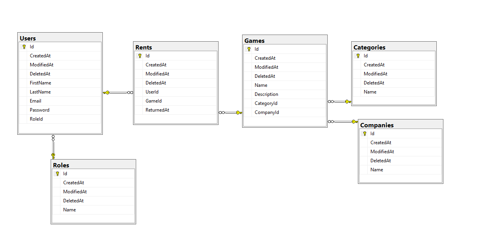

**GameRent**
========
This is a project for School subject made in **ASP .NET Core Framework**  

Tema projekta i opis funkcionalnosti
------------
Tema projekta je izdavanje video igrica (slicno kao video klub). Korisnik moze uzeti samo jednu video igricu na neodredjen period. Kada korisnik vrati video igricu, ta igrica postaje dostupna drugim korisnicima za uzimanje a korisnik moze da uzme drugu igricu. Igrice je moguce sortirati po kategoriji i po proizvodjacu.

Implementirano:  
---------------
- [x] Migracije i code-first pristup za bazu
- [x] Seeding za bazu
- [x] Dodavanje kategorije igrice (API)
- [x] Dodavanje proizvodjaca igrice (API)
- [x] Dodavanje igrice (API)
- [x] Rentiranje igrice (API)
- [x] Vracanje igrice (API)
- [x] Swagger specifikacija

Dizajn baze podataka
--------------------

    
